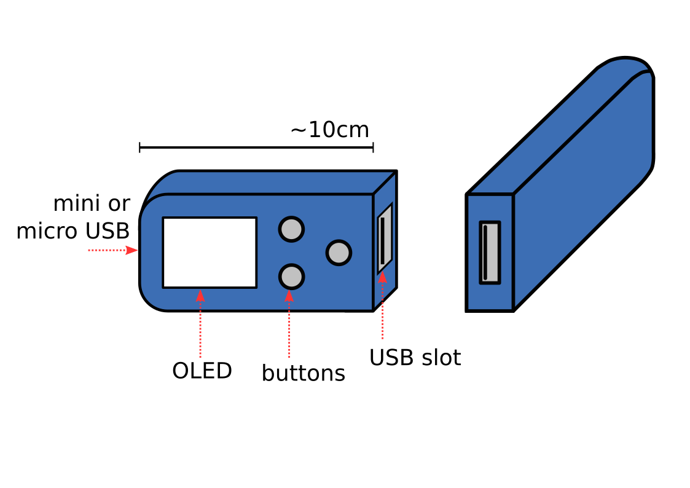

Fedorator Tiny
===

This is a repo containing source files for the Fedorator Tiny.

The Fedorator is a device for writing a live image of
[Fedora](http://fedoraproject.org/), the Linux distribution, onto a USB
flash drive.

There are two dependancies.  Please put them in the lib/ directory.

* [teensy36 branch of my fork of esp8266-oled-ssd1306](https://github.com/Sanqui/esp8266-oled-ssd1306/tree/teensy36)
* [USBHost_t36](https://github.com/PaulStoffregen/USBHost_t36.git)

Concept
---

Instead of standing still while being manipulated, this Fedorator is designed to be picked up and held in a hand.  The OLED screen is small yet sharp and despite providing only a binary image it works well enough for our purposes.  The three buttons allow for selecting the desired live image.

Due to its small size, this device will be powered by an Arduino board.

This design needs to be powered by cable.  This cable will be permanently attached by the means of enclosure.  This has the positive side effect of discouraging people from attempting to leave with the Fedorator.

Because it only has a single USB slot, it may be desirable to provide multiple instances of the Fedorator Tiny.
